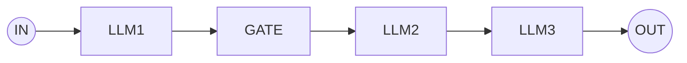
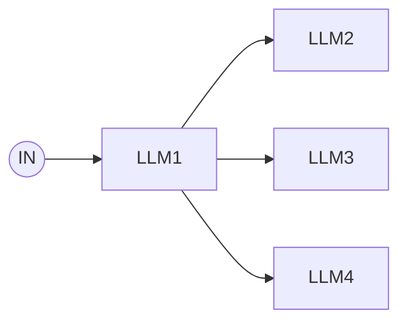

# agent

## Prompt Chaining 
Decomposing into fixed subtasks. 

```mermaid
flowchart LR;
    IN((IN))-->LLM1;
    LLM1-->GATE;
    GATE-->LLM2;
    LLM2-->LLM3;
    LLM3-->OUT((OUT));
```

## Routing 
A LLM decides which LLM to route the task into

```mermaid

flowchart LR;
    IN((IN))-->LLM1;
    LLM1-->LLM2;
    LLM1-->LLM3;
    LLM1-->LLM4;

```
