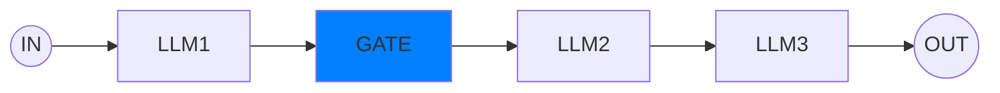
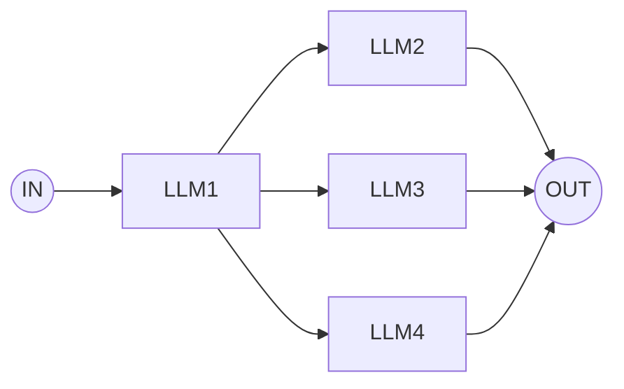
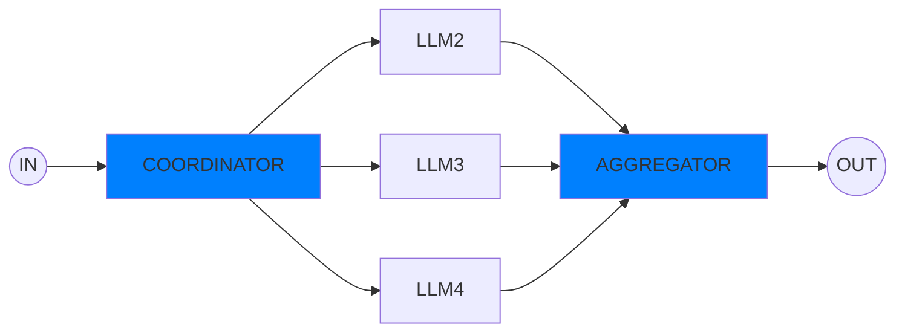
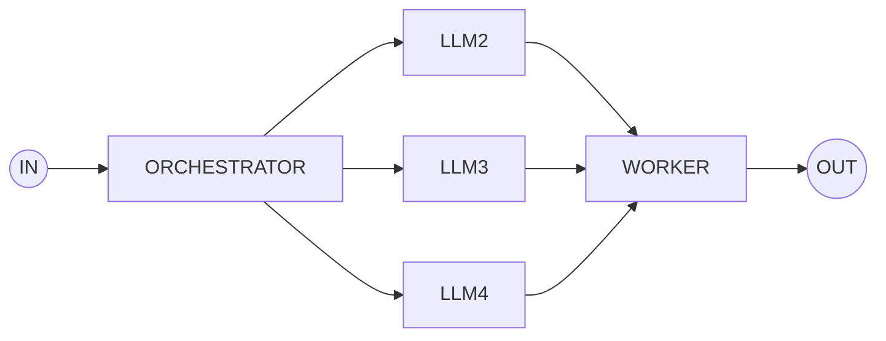
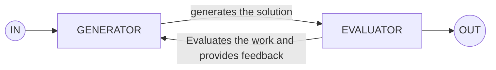

# agent

Blue boxes are Applications. Rest are LLMs. 
- Prompt chaining
- Routing
- Paralleization
- Orchestrator-worker
- generator-evaluator

## Prompt Chaining 
Decomposing into fixed subtasks. 

## Routing 
A LLM decides which LLM to route the task into

## Parallelization
Concurrent task break down by a GATE and Aggregating by a Aggregator

## Orchestrator-Worker
Concurrent task break down by a Orchestrator and Aggregating by a Worker, both of which are LLM

## LLM Generator Evaluator Loop (Very Popular)

## What models should we be using 
- Open API:  gpt-4o-mini , o1,o3-mini
- Antropic:  cloude-3-7-sonet 
- Google: gemini-2-0-flash
- Deep Seek: Deep SeekAI , Deep Seek: R1 (It costs a fraction 30 times less spend than Open API)
- Groq : llama3.3
- Ollama: local model . 
- Grok: Elon Musk . 

Duet - AI 
LeaderBoard - Vellum leaderboard . https://www.vellum.ai/llm-leaderboard 

