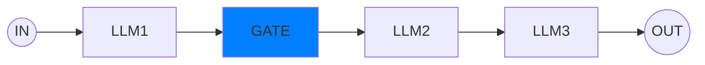
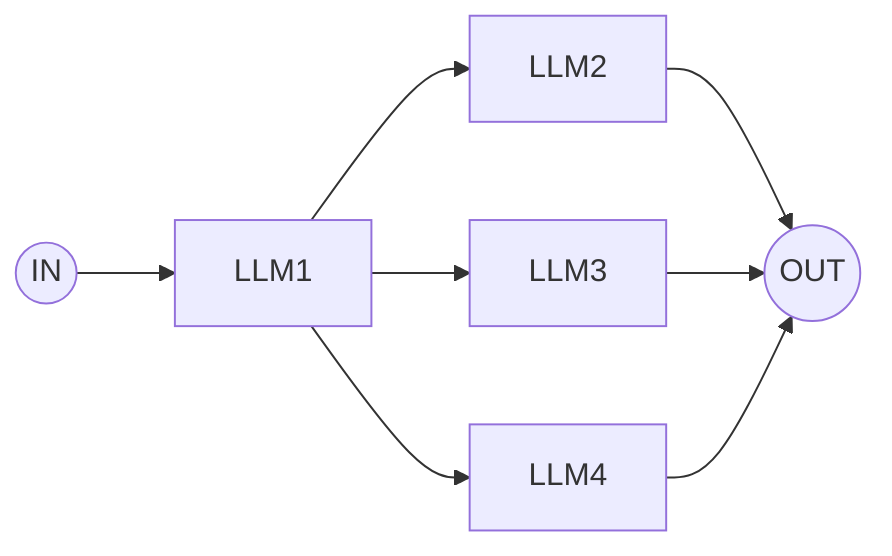
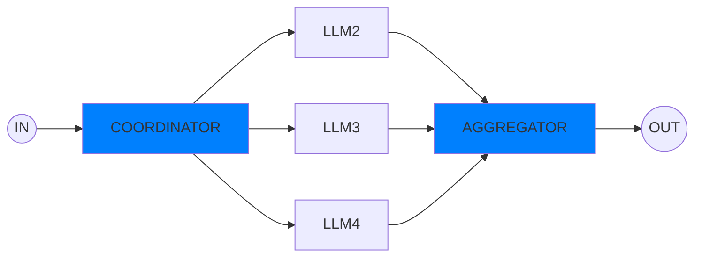
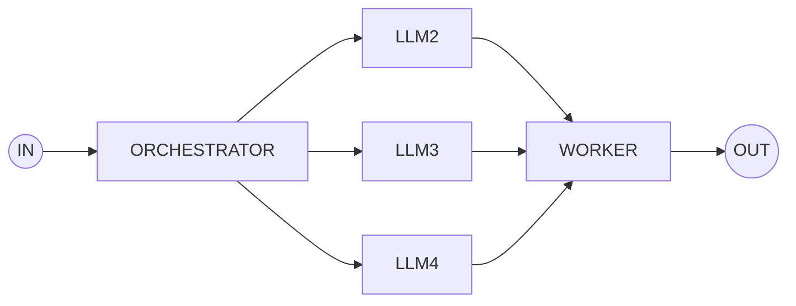

# agent

Blue boxes are Applications. Rest are LLMs. 

## Prompt Chaining 
Decomposing into fixed subtasks. 



## Routing 
A LLM decides which LLM to route the task into



## Parallelization
Concurrent task break down by a GATE and Aggregating by a Aggregator


## Orchestrator-Worker
Concurrent task break down by a Orchestrator and Aggregating by a Worker, both of which are LLM

## LLM Generator Evaluator Loop (Very Popular)
```mermaid

flowchart LR;
    IN((IN))-->GENERATOR;
    GENERATOR-->EVALUATOR:generates the solution;
    EVALUATOR-->GENERATOR:Evaluates the work and provides feedback;
    EVALUATOR-->OUT((OUT))

```


